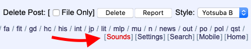
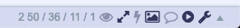
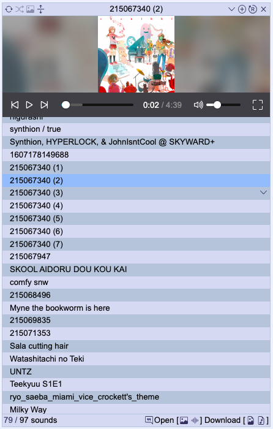
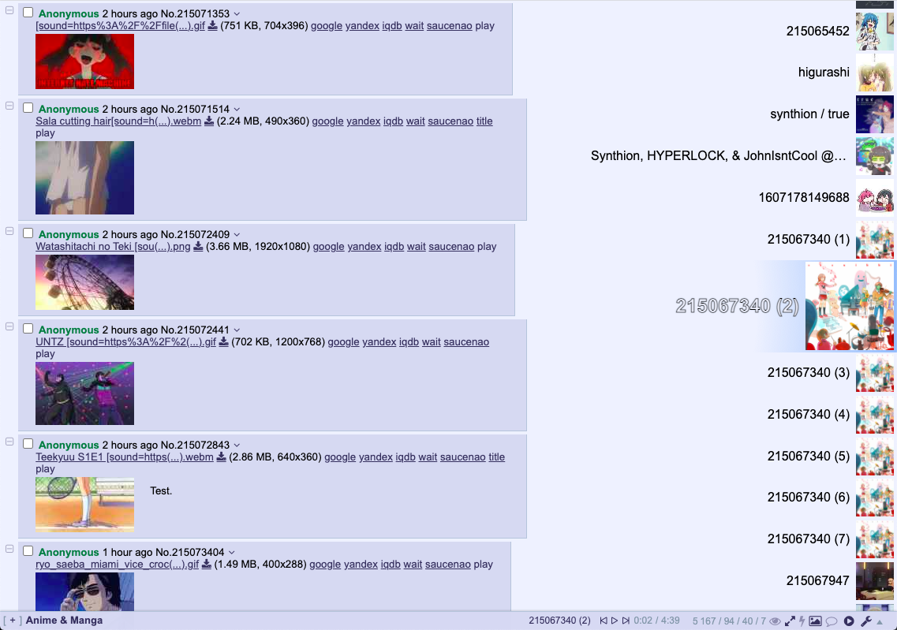
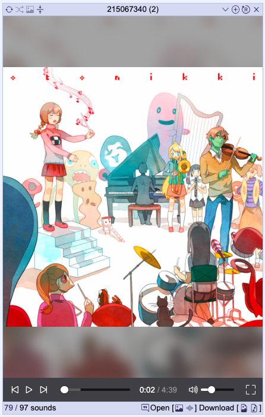
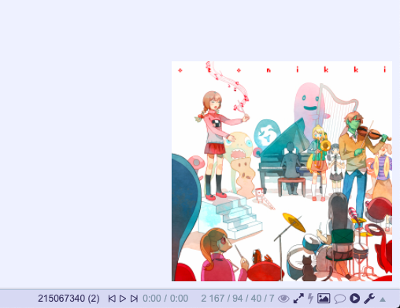
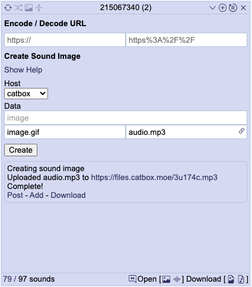

# 4chan Sounds Player

A floating player for 4chan sounds threads. 

If you have [4chan External Sounds](https://greasyfork.org/en/scripts/31045-4chan-external-sounds) installed make you sure disable the inline player of this script under Settings > Playback.

## Install
[Stable](https://raw.githubusercontent.com/rcc11/4chan-sounds-player/master/dist/4chan-sounds-player.user.js), [Beta](https://raw.githubusercontent.com/rcc11/4chan-sounds-player/master/dist/4chan-sounds-player-beta.user.js).

## Contents
- [Sound Player UI](#sound-player-ui)
- [Creating Sound Images](#creating-sound-images)
- [Searching for Threads](#sound-threads-search)
- [Themes](#themes)
- [API](#api)

## Sound Player UI

A link to open the player is shown at the top and bottom of the page, next to settings.

For 4chan X the link is in the header.

#### Display Modes

The playlist view lists all the sounds in the thread. You can drag items to adjust the play order. There are two [themes](#themes) that come with the player for modifying the playlist display.

The default playlist.

The fixed playlist fixes the playlist to the right of the page at full height. With this theme every but the playlist is hidden, with the header showing if you hover over the top. You can expand the playlist by dragging the left side of the header.

The playlist can be toggled by a button in the heading. With it hidden the image/video will fill the player.

You can opt to display a thumbnail in the bottom right of the page while the player is hidden. The example here shows a rather large image but the size is customisable. If you have 4chan X you can also have the sound controls be displayed in header.

#### Inline Player

The inline player can be set to play sounds when images are expanded, or full images are shown when hovering over thumbnails. If you have [4chan External Sounds](https://greasyfork.org/en/scripts/31045-4chan-external-sounds/code) installed you'll want to disable this under Settings > Playback.

#### Position/Resizing

The player can be moved by dragging the header and resized by dragging each corner.

#### Adding Local Files

To add local files (images with `[sound=<url>]` filenames) you can either click the + button in the header and select the files you want or drag and drop files onto the player.

If you want to test out a sound before you post it this is a good method of doing so.

## Creating Sound Images

A sound is set on an image by adding `[sound=<url>]` to the filename, where url is a link to the audio file. You can add as many sounds in this format as the filename length permits. The url needs to encoded so it's valid as part of a filename.

To create images using the sound player go to the tools view. The form here allows you to select/drop an image and sound. The sound will be uploaded to the selected host and the image will be renamed to include a a link to it. You can also select multiple sounds to add to a single image, but keep in mind the filename length limit when doing so. Once complete you can choose to post the created image, download it, or add it to the player. There are a few default hosts, but you can set up whatever hosts you want under Settings>Hosts. If you have a user token for the default hosts you can also set that there. Be aware that the default host filters only include default upload hosts.

## Sound Threads Search

The threads views allows you to search for threads that include a sound in the OP. You can select which boards to search and a search term to filter by.

The threads can be displayed in a table or a pseudo-board.

## Themes

There are two theme provided by default. The floating player, and a fixed playlist. By using templates and custom CSS you can create your own saved themes, and set keybinds to switch between.

#### Creating Themes

Certain sections of the UI allow you to provide custom HTML templates. In doing so the replacements below will be made to the provided template.

For the templates other than the row template, values that refer to a sound reference whichever is currently playing (or paused). So `p:{}` in the footer template will show the content if any sound is selected, whereas `p:{}` in the row template will show the content for only the row that is currently playing.

__Conditional Display__
- `p:{ <content> }` - Only displays the given content if the sound is currently selected.
- `h:{ <content> }` - Only displays the given content if the cursor is hovering over the element (i.e. the footer or row). Note that unlike `p:{}` that fully omits the contents this will instead wrap it in a containing div. If that messes up your template you can set a class of `fcsp-hover-display` on elements to achieve the same effect instead.

For both `p:{}` and `h:{}` the content given will have the same replacements applied. So, for example, you can choose to only show the menu button when hovering over a row by adding `h:{ menubutton }` to the row template.

__Sound Properties__
- `sound-count` - The number of songs added to the player.
- `sound-index` - The index of the sound (starting from 1).
- `sound-title` - The name of the sound. If you want to scroll long sound names use `sound-title-marquee`.
- `src` - The src for the sound file.
- `id` - An identifier for the sound.
- `title` - Same as sound-name but without being wrapped in any html
- `post` - The post identifier for the sound.
- `imageOrThumb` - Full size image URL for images, or thumbnail URL for webms.
- `image` - Full image/webm URL.
- `thumb` - Thumnail URL.
- `filename` - The entire filename, including `[sound=...]`.
- `imageMD5` - MD5 of the image.

__Config Properties__
The format for any config property is `$config[property]`. You can reference any config value but mainly the only useful ones are colors.
They're the ones defined in Settings > Display.
- `colors.text`
- `colors.background`
- `colors.border`
- `colors.odd_row`
- `colors.even_row`
- `colors.playing`
- `colors.dragging`
- `colors.controls_background`
- `colors.controls_inactive`
- `colors.controls_active`
- `colors.controls_empty_bar`
- `colors.controls_loaded_bar`
- `colors.page_background` - This one is the body background color, and is not configurable.
- `offsetTop` - This is the offset from top to account for the 4chan X header. Also not configurable.
- `offsetBottom` - And the offset if the 4chan X header is at the bottom.

__Links/Buttons__

All the values here can be followed by `:""` to specify the text, otherwise they will default to icons with 4chan X or short text displays.
- `playing-link` - Jumps to the sound in the playlist.
- `post-link` - Jumps to the post for the sound.
- `image-link` - Opens the sounds image in a new tab.
- `sound-link` - Opens the sounds source in a new tab.
- `dl-image-button` - Download the sounds image with the original filename, i.e including `[sound=...]`.
- `dl-sound-button` - Download the sound audio itself.
- `filter-image-button` - Add the image MD5 to the filters.
- `filter-sound-button` - Add the sound URL to the filters.
- `remove-button` - Remove the sound from the player. Removed sounds can be re-added using the reload button.
- `menu-button` - Open the dropdown menu for the sound. You can right click the sound item to open it instead.
- `repeat-button` - Toggles the repeat setting between all, one and none.
- `shuffle-button` - Toggles shuffle.
- `playlist-button` - Toggles between the playlist and image view.
- `hover-images-button` - Toggles hover images in the playlist.
- `add-button` - Open the file input to add local files.
- `reload-button` - Reloads the sounds from the thread to add any missing files. Useful if you change the allowed hosts or filters but generally all sounds should already be added.
- `view-menu-button` - Open the view menu dropdown to switch between views.
- `settings-button` - Open/close the settings.
- `threads-button` - Open/close the threads search view.
- `tools-button` - Open/close the tools view.
- `close-button` - Hide the player.

__4chan X Header Controls__

For the 4chan X Header Controls template there are extra replacements, in addition to the ones above.

- `prev-button` - Play the previous sound.
- `play-button` -  Play/pause the current sound.,
- `next-button` -  Play the next sound,
- `sound-current-time` -  Display the playback time,
- `sound-duration` -  Display the track duration.

__Custom CSS__

The only replacements made to custom CSS are config values and sound properties.

## API

The player can be controlled by using PlayerEvents with an action and arguments. The documentation below is as if you were calling the functions directly, but you'll need to send events as below.

`document.dispatchEvent(new CustomEvent('PlayerEvent', { detail: { action: '<function name>', arguments: ...<args> } }))`

#### Playback
- `play()` - Play audio.
- `pause()` - Pause audio.
- `togglePlay()` - Play/pause the audio.
- `next({ group: Boolean, force: Boolean })` - Skip to the next sound. Pass `group: true` to the next sound image, and `force: true` to ignore repeat one being set.
- `previous({ group: false, force: false })` - Skip to the previous sound. Same arguments as `next`.
- `stop()` - Stop playback and close (not hide) the player.
- `volumeUp()` - Raise the volume by 5 percent.
- `volumeDown()` - Lower the volume by 5 percent.
- `toggleMute()` - Mute/unmute.
- `show()` - Display the player.
- `hide()` - Minimise the player.
- `playlist.search(value)` - Show search results for the given value in the playlist.
- `theme.switch(name)` - Switch theme.
- `theme.next()` - Switch to the next theme, according to the configured order.
- `theme.previous()` - Switch to the previous theme, according to the configured order.
- `set(property, value, { bypassValidation } )` - Set a config value. If `bypassValidation` is not set the value will be checked for changes and ignored if it's the same.
- `settings.export()` - Trigger an export of the user settings.
- `settings.import()` - Trigger a file input to import user settings.
- `settings.load(settings, { applyDefault: false })` - Load a user settings object. If `applyDefault` is set any settings not included in the given object will be set to the default. Otherwise they are left unchanged.

## FFmpeg Version

The [FFmpeg version](./dist/4chan-sounds-player-ffmpeg.user.js) of this userscript makes use of [ffmpeg.js](https://github.com/Kagami/ffmpeg.js/) licensed under the [LGPL](https://www.gnu.org/licenses/lgpl-3.0.html).

In order to function as a userscript require [a copy](./dist/ffmpeg-webm.js) is provided wrapped as `(function (self) { let module = {}; <ffmpeg.js> self.ffmpeg=module.exports;})(self);`.

The FFmpeg version allows the sound image creation tool to accept a webm with audio and split it into separate video and audio files. The benefit of this weighed against the sizable added require is slim if not none, especially considering it's a step you can easily do during the creation of a webm.