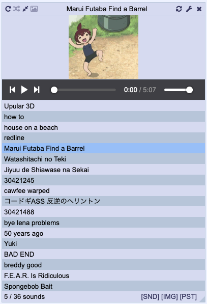
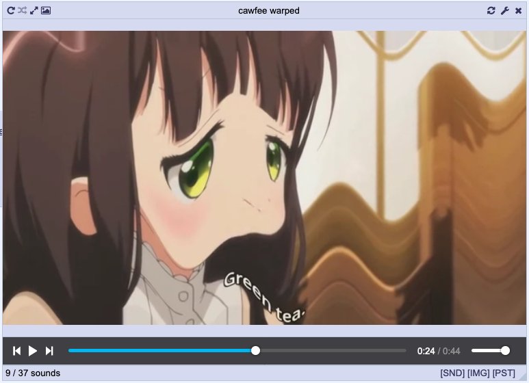
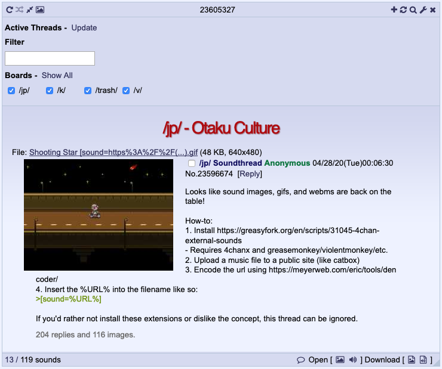

# 4chan Sounds Player

A floating player for 4chan sounds threads. 

## Install
[Stable](https://raw.githubusercontent.com/rcc11/4chan-sounds-player/master/dist/4chan-sounds-player.user.js), [Beta](https://raw.githubusercontent.com/rcc11/4chan-sounds-player/master/dist/4chan-sounds-player-beta.user.js).

There's also an [FFmpeg version](#ffmpeg-version).

## Sound Player UI

A link to open the player is shown at the top and bottom of the page, next to settings.

For 4chan X the link is in the header.

#### Display Modes

The playlist view lists all the sounds in the thread. You can drag items to adjust the play order.

The playlist can be toggled by a button in the heading. With it hidden the image/video will fill the player.

You can opt to display a thumbnail in the bottom right of the page while the player is hidden. The example here shows a rather large image but the size is customisable. If you have 4chan X you can also have the sound controls be displayed in header.

#### Position/Resizing

The player can be moved by dragging the header and resized by dragging bottom right corner of the footer.

#### Adding Local Files

To add local files (images with `[sound=url]` filenames) you can either click the + button in the header and select the files you want or drag and drop files onto the player.

If you want to test out a sound before you post it this is a good method of doing so.

## Tools

#### Encode/Decode URLS

Just two inputs that let you paste encoded and decoded URLs.

#### Create Sound Image

This form allows you to select/drop an image and sound. The sound will be uploaded to the selected host and the image will be renamed to include a `[sound=url]` link to it. You can also select multiple sounds to add to a single image, but keep in mind the filename length limit when doing so. Once complete you can choose to post the created image, download it, or add it to the player. Refer to [Hosts](#hosts) for the configuration.

## Sound Threads Search

The threads views allows you to search for threads that include a sound in the OP. You can select which boards to search and a search term to filter by.

The threads can be displayed in a table or a pseudo-board.

## Settings

#### Display

- __Autoshow__ - Open the player automatically for threads that contain sounds.
- __Pause on hide__ - Pauses the player when it's hidden.
- __Colors__ - By default the player will attempt to match the board theme, but you can set your own colors. Selecting "Match Theme" will revert to matching the board theme after making any modifications.
- __Controls__
	- _Prevent Wrapping_ - Progressively hide controls as the player shrinks to prevent them wrapping on to a new line.
	- _Hide Order_ - The order in which controls hide.
- __Threads__
	- _Auto Scroll_ - Automatically scroll the thread to posts when they are played.
	- _Limit Post Widths_ - Reduces the widths of posts that are next to the player so they're not hidden beneath it. A minimum width can be set.
- __Minimised Display__
	- _Thumbnail_ - Whether to display a thumbnail of the playing sound in the bottom right corner of the window when the player hidden. The thumbnail size can be set.
	- _4chan X Header Controls_ - Whether to show playback controls in the 4chan X header. They be set to show always, only with the player hidden, or never.

#### Keybinds

- __Keybinds__ - Keyboard shortcuts can be assigned to control the player and playback. They can be always enabled, enabled only when the player is open, or disabled.

#### Filter

- __Include WebM__ - Add WebM files to the player, regardless of sound filenames. Intended more for /gif/ and /wsg/.
- __Allowed Hosts__ - Which hosts the player will add sounds from.
- __Filters__ - Sounds or images to ignore. On each line add the URL of the sound or the MD5 of the image you want to filter and they will no longer be added to the player. Lines starting with a `#` are ignored. The menu for playlist items has links to add the sound or image to the filters.

#### Templates
- __Footer/Header/Row/4chan X Header Contents__ - Custom display templates. See [Content Templates](#content-templates) below for usage.

#### Hosts

- __Hosts__ - The hosts used for uploading created sounds. Each host is configured using the following properties.
    - __Name__ - A unique name used as the host identifier.
	- __URL__ - The URL the file is updated to do.
	- __Data__ - A JSON object representing the form data posted for the upload. The file is specified by setting `$file` as the value.
	- __Headers__ - _(Optional)_ Request headers.
	- __Response Path__ - _(Optional)_ A path to locate the URL for the uploaded sound in a JSON response.
	- __Response Match__ - _(Optional)_ A regular expression where the first match group is used to identify the URL for the uploaded sound in the response text.
	- __Sound URL__ - _(Optional)_ A URL that where `%s` is replaced the result of the result path or result match.

Various hosts accept a token for user identification. These are typically identified in the default setup as a null value which you can replace with your token.

## Styling

See [the readme](./themes/README.md).

## FFmpeg Version

The [FFmpeg version](./dist/4chan-sounds-player-ffmpeg.user.js) of this userscript makes use of [ffmpeg.js](https://github.com/Kagami/ffmpeg.js/) licensed under the [LGPL](https://www.gnu.org/licenses/lgpl-3.0.html).

In order to function as a userscript require [a copy](./dist/ffmpeg-webm.js) is provided wrapped as `(function (self) { let module = {}; <ffmpeg.js> self.ffmpeg=module.exports;})(self);`.

The FFmpeg version allows the sound image creation tool to accept a webm with audio and split it into separate video and audio files. The benefit of this weighed against the sizable added require is slim if not none, especially considering it's a step you can easily do during the creation of a webm.