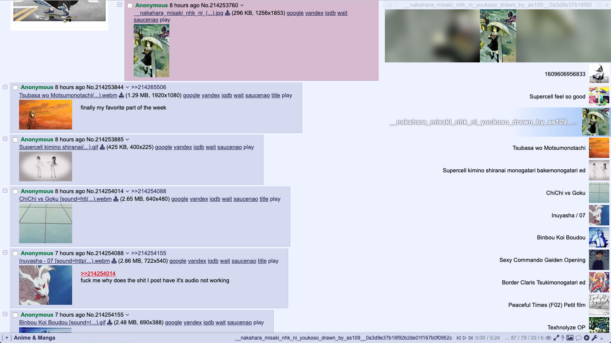
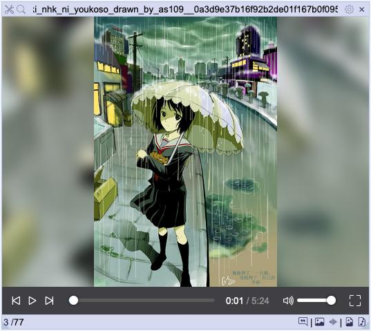

# 4chan Sounds Player Themes

To install go to settings and import.
To create go to settings > templates and modify the templates there.

### Fixed Playlist

## Creating Templates

Certain sections of the UI allow you to provide custom HTML templates. In doing so the replacements below will be made to the provided template.

For the templates other than the row template, values that refer to a sound reference whichever is currently selected (playing/paused). So `p:{}` in the footer template will show the content if any sound is selected, whereas `p:{}` in the row template will show the content for only the row that is currently selected.

For both `p:{}` and `h:{}` the content given will have the same replacements applied. So, for example, you can choose to only show the menu button when hovering over a row by adding `h:{ menubutton }` to the row template.

__Conditional Display__
- `p:{ <content> }` - Only displays the given content if the sound is currently selected.
- `h:{ <content> }` - Only displays the given content if the cursor is hovering over the element (i.e. the footer or row). Note that unlike `p:{}` that fully omits the contents this will instead wrap it in a containing div. If that messes up your template you can set a class of `fc-sounds-hover-display` on elements to achieve the same effect instead.

__Sound Properties__
- `sound-count` - The number of songs added to the player.
- `sound-index` - The index of the sound (starting from 1).
- `sound-name` - The name of the sound. If you want to scroll long sound names use `sound-name-marquee`.
- `src` - The src for the sound file.
- `id` - An identifier for the sound.
- `title` - Same as sound-name but without being wrapped in any html
- `post` - The post identifier for the sound.
- `imageOrThumb` - Full size image URL for images, or thumbnail URL for webms.
- `image` - Full image/webm URL.
- `thumb` - Thumnail URL.
- `filename` - The entire filename, including `[sound=...]`.
- `imageMD5` - MD5 of the image.

__Config Properties__
The format for any config property is `$config[property]`. You can reference any config value but the only useful ones are colors.
They're the ones defined in settings > display.
- `colors.text`
- `colors.background`
- `colors.border`
- `colors.odd_row`
- `colors.even_row`
- `colors.playing`
- `colors.dragging`
- `colors.controls_background`
- `colors.controls_inactive`
- `colors.controls_active`
- `colors.controls_empty_bar`
- `colors.controls_loaded_bar`
- `colors.page_background` - This one is the body background color, and is not configurable.

__Links/Buttons__

All the values here can be followed by `:""` to specify the text, otherwise they will default to icons with 4chan X or short text displays.
- `playing-link` - Jumps to the sound in the playlist.
- `post-link` - Jumps to the post for the sound.
- `image-link` - Opens the sounds image in a new tab.
- `sound-link` - Opens the sounds source in a new tab.
- `dl-image-button` - Download the sounds image with the original filename, i.e including `[sound=url]`.
- `dl-sound-button` - Download the sound audio itself.
- `filter-image-button` - Add the image MD5 to the filters.
- `filter-sound-button` - Add the sound URL to the filters.
- `remove-button` - Remove the sound from the player. Removed sounds can be re-added using the reload button.
- `menu-button` - Open the dropdown menu for the sound. You can right click the sound item to open it instead.
- `repeat-button` - Toggles the repeat setting between all, one and none.
- `shuffle-button` - Toggles shuffle.
- `playlist-button` - Toggles between the playlist and image view.
- `hover-images-button` - Toggles hover images in the playlist.
- `add-button` - Open the file input to add local files.
- `reload-button` - Reloads the sounds from the thread to add any missing files. Useful if you change the allowed hosts or filters but generally all sounds should already be added.
- `view-menu-button` - Open the view menu dropdown to switch between views.
- `settings-button` - Open/close the settings.
- `threads-button` - Open/close the threads search view.
- `tools-button` - Open/close the tools view.
- `close-button` - Hide the player.

__4chan X Header Controls__

For the 4chan X Header Controls template there are extra replacements, in addition to the ones above.

- `prev-button` - Play the previous sound.
- `play-button` -  Play/pause the current sound.,
- `next-button` -  Play the next sound,
- `sound-current-time` -  Display the playback time,
- `sound-duration` -  Display the track duration.
